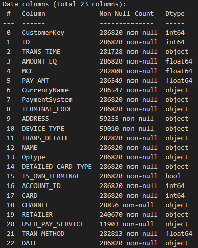
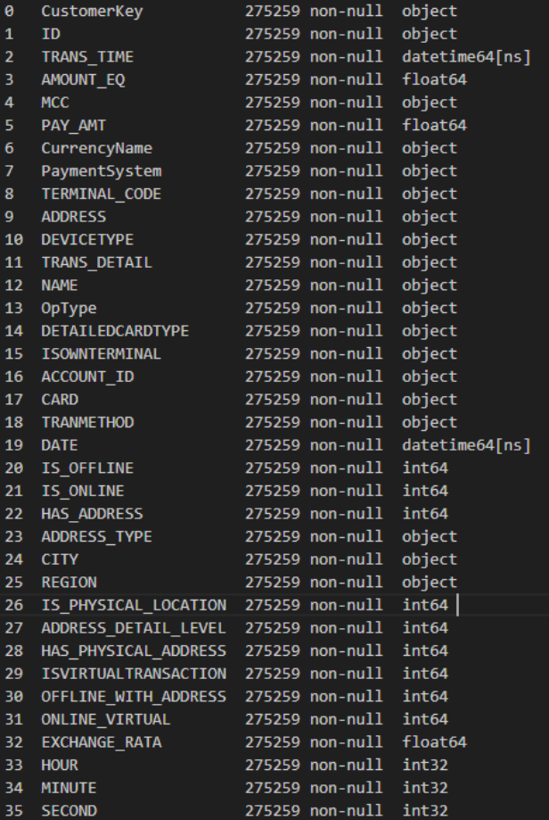
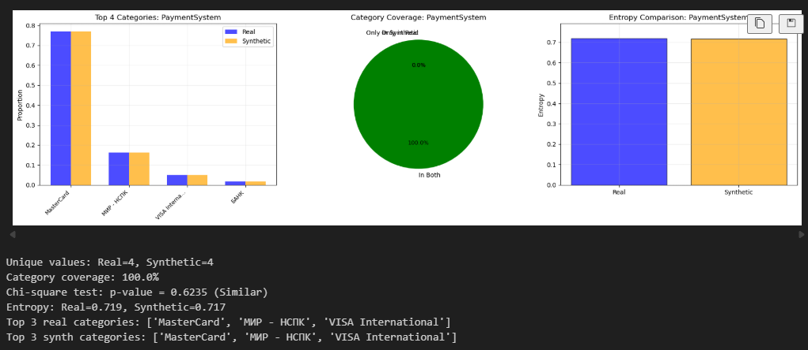
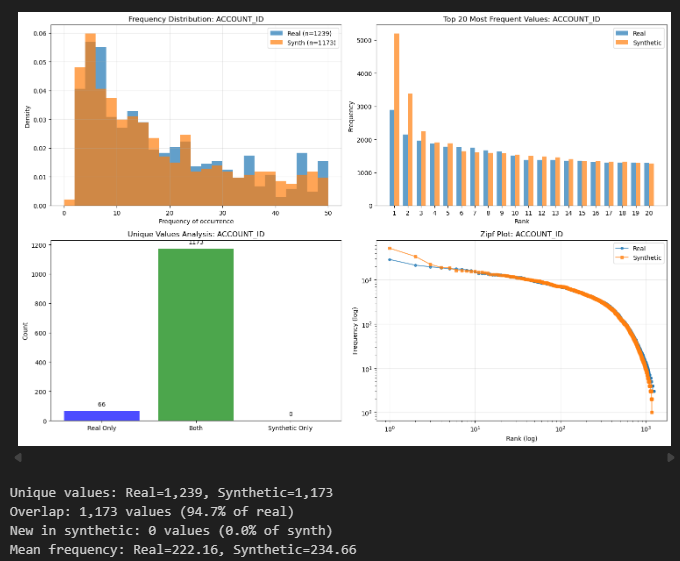
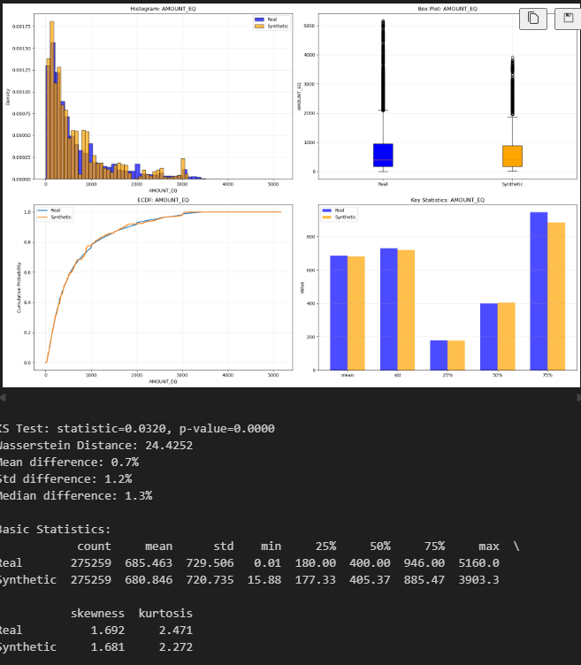
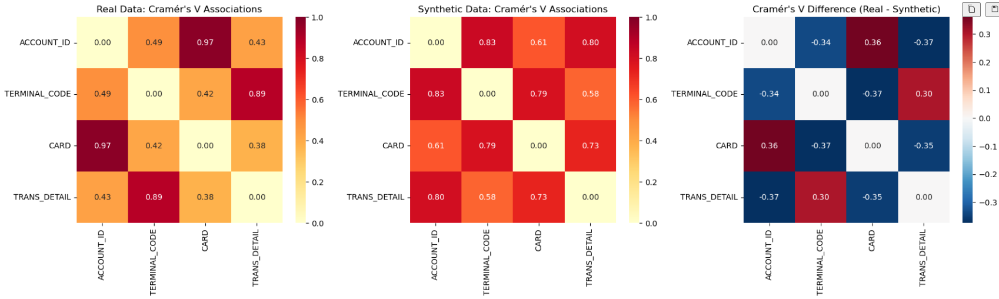

# НИР: Генерация синтетических табличных данных для банка
### TRGAN
Модель генерации синтетических данных о транзакциях, состоящая из генератора, супервизора и двух дискриминаторов. В качестве входных данных используется ограниченный стохастический процесс из семейства DCL вместо стандартного гауссовского шума для учёта временных зависимостей и сглаживания переходов между транзакциями.

Предложенная модель для генерации синтетических данных, полное описание находится здесь: https://github.com/ievlev-k/TRGAN

Во взятой версии модели содержались ошибки, связанные с конфликтами версий. В ходе работы удалось запустить модель и исправить ошибки.
Основные ошибки возникали при кодировании данных, обучении на GPU, генерации записей, отличных от исходных, и загрузке модели из файла.

### data_preprocessing_sber

Здесь происходит предобработка данных.
На рисунке ниже продемонстрирован пример данных до обработки с большим количеством пропусков и сложными составными данными, например, адресом, где через запятую разбиты разные части адреса с пропусками.



Ниже представленны данные после обработки. 




1. Данные приведены к нужным типам
2. Удалены признаки 'CHANNEL', 'RETAILER', 'USED_PAY_SERVICE'
3. Переименованы признаки для соответствия модели
4. Заполнены пропуски для DEVICE_TYPE на основе других признаков
5. Разбивается ADDRESS на несколько признаков (CITY, REGION, IS_PHYSICAL_LOCATION и т.д.)
6. Создание новых признаков, например, тип транзакции (онлайн или офлайн)
7. Обработка временных признаков, разбиение на часы, минуты, секунды.

### TRGAN_sber_v1
Здесь происходит непосредственное обучение модели.

Для генерации данные разбиты по типам:

```python
onehot_cols = ['PaymentSystem', 'OpType', 'DETAILEDCARDTYPE', 'TRANMETHOD', 'ISOWNTERMINAL', 'NAME', 'MCC', 'DEVICETYPE', 'CurrencyName', 'CITY', 'REGION', 'ISVIRTUALTRANSACTION']
cat_feat_names = ['ACCOUNT_ID', 'TERMINAL_CODE', 'CARD', 'TRANS_DETAIL']
num_feat_names = ['AMOUNT_EQ', 'HOUR', 'MINUTE', 'SECOND', 'EXCHANGE_RATA']
log1p_transform_cols = ['AMOUNT_EQ', 'EXCHANGE_RATA']  # если суммы имеют skewed распределение
date_feature = 'DATE'
time_feature = 'TRANS_TIME'
client_id = 'ACCOUNT_ID'
mcc_name = 'MCC'
latent_dim = {'onehot': 128, 'categorical': 16, 'numerical': 4, 'cv': 32}
```

Далее происходит этап получения эмбеддингов, условного вектора и скалеров.

```python

X_emb, X_oh, cond_vector, synth_date, scaler_cat, scaler_onehot, scaler_num, cv_params, scaler, round_array = \
            trgan.embeddings(data, cat_feat_names, num_feat_names, onehot_cols, date_feature, time_feature, client_id, latent_dim, device=DEVICE, load=False, epochs=40, directory='Pretrains_model_sber/Pretrains_ALL/')

```

После чего происходит обучение генератора и супервизора с сохранением моделей в файлы.


```python
generator, supervisor, loss_array = trgan.train(X_emb, cond_vector, latent_dim, dim_noise, epochs=40, load=False, experiment_id='sber', DIRECTORY='Pretrains_model_sber/Pretrains_ALL/')
```

### load_model

В этом модуле происходит загрузка ранее обученных моделей для генерации данных.

Получение эмбеддингов.

```python
X_emb, X_oh, cond_vector, synth_date, scaler_cat, scaler_onehot, scaler_num, cv_params, scaler, round_array = embeddings(
    data=data,  
    cat_feat_names=cat_feat_names,
    num_feat_names=num_feat_names,
    onehot_cols=onehot_cols,
    date_feature=date_feature,
    time_feature=time_feature,
    client_id=client_id,
    latent_dim=latent_dim,
    device=device,
    load=True, 
    directory=directory
)
```
Загрузка обученных моделей.


```python
generator, supervisor, loss_array = load_model(
    latent_dim=latent_dim,
    dim_noise=20,  # размерность шума (должен совпадать с обучением)
    experiment_id=experiment_id,
    DIRECTORY=directory,
    DEVICE=device,
)
```
Генерация новых данных.

 
```python
synth_data, synth_date_gen, params = sample(
    n_samples=n_samples_data_len,
    generator=generator,
    supervisor=supervisor,
    noise_dim=20,  # размерность шума
    cond_vector=cond_vector,
    X_emb=X_emb,
    encoder=cv_params['encoder'],  # энкдер условного вектора
    data=data,  # нужен для генерации времени (можно передать исходные данные или заглушку)
    date_feature=date_feature,
    name_client_id=client_id,
    time_type='synth',  # или 'initial' если хочешь исходные времена
    cv_params=cv_params,
    device=device
)
```

Последним действием идет приведение данных к исходному формату.
```python
X_emb1 = scaler.inverse_transform(X_emb)
synth_data = scaler.inverse_transform(synth_data)
print(synth_data)

synth_df = inverse_transform(synth_data, latent_dim, X_oh.columns, scaler_onehot, scaler_cat, scaler_num, cat_feat_names,
                             mcc_name, num_feat_names, True, synth_date_gen, time_feature, round_array, device=device)
```

### metrics_st1
Здесь происходит оценка качества генерируемых данных в сравнении с исходными.
Реализованные функции для сравнения находятся в файле metrics.py.

test_onehot_fields - сравнение категориальных признаков. Здесь сравнивается покрытие и распределение признаков.




test_categorical_fields - сравнение категориальных признаков с большим количеством типов.
Здесь также показана частота распределения и покрытие.




test_numerical_fields - сравнение числовых признаков. Проверяются статистические показатели, такие как среднее значение, асимметрия, эксцесс.




analyze_categorical_correlations - анализ корреляции признаков.




# Метрики производительности

По метрикам качества, модель может генерировать качественные данные с характеристиками, похожими на исходные. Ниже представлена таблица производительности, которая показывает адекватное время для генерации большого количества данных (3 691 283 строк и 21 колонка).

| Этап         | GPU        | CPU        |
|--------------|------------|------------|
| Кодирование  | 01:54:11   | 02:34:06   |
| Обучение     | 00:51:35   | 00:53:13   |
| Генерация    | 00:06:31   | 00:03:31   |
| **Итого**    | **02:52:17** | **02:52:17** |

